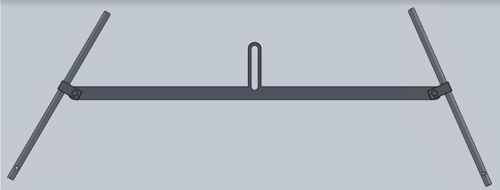
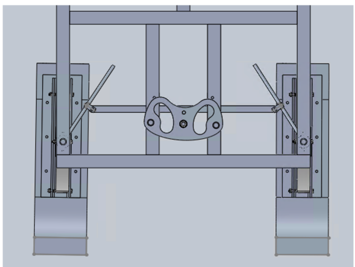
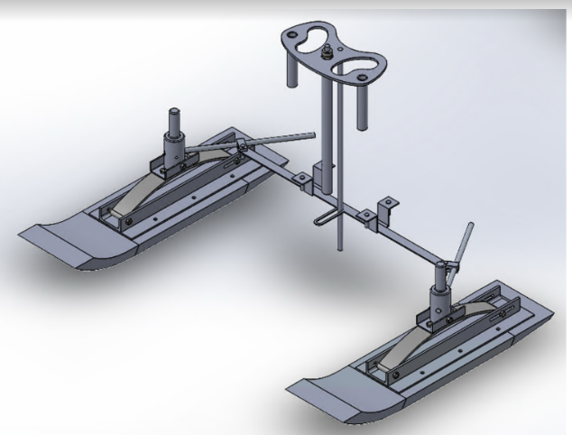
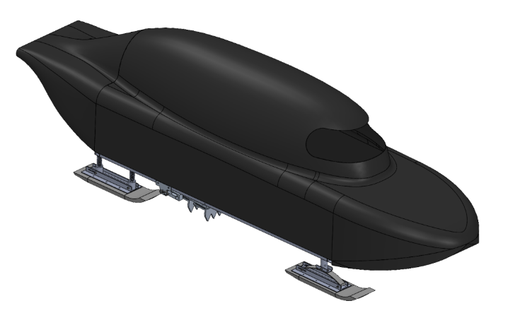

# Concrete_Toboggan

## Overview
The Concrete Toboggan project involved the design, engineering, and fabrication of a high-performance toboggan for the Greater Northern Concrete Toboggan Race. This project showcased a combination of CAD modeling, precision machining, and practical engineering skills. A toboggan is essentially a sled that is used on the snow to carry individuals down a hill. The toboggan had five main functions:
* Carry five riders down a hill while providing protection;
* Have a fully concrete running surface (skis) that supports dynamic and static loading;
* Navigate through obstacles by means of a steering mechanism; 
* Come to a complete stop by means of a braking mechanism. 

## Key Achievements
* **3D CAD Modeling**: Designed a sophisticated 3D CAD model using SolidWorks software. The model featured a Davis steering system, incorporating innovative components like a scotch yoke and a steering wheel, ensuring precise control over the toboggan's steering mechanism.

* **Precision Machining**: Fabricated precise parts for assembly in the machine shop, utilizing lathe and mill machines to ensure manufacturing accuracy and the reliability of critical components.

* **National Recognition**: Achieved an impressive 3rd-place national ranking in the Greater Northern Concrete Toboggan Race for 2022, demonstrating the practical application of engineering principles and innovative design.

## Technologies Used
* **SolidWorks**: Utilized SolidWorks for 3D CAD modeling, allowing for detailed design and analysis of the toboggan's components.

* **Machining Principles**: Applied machining principles in the machine shop to manufacture custom parts with precision and reliability.

## Process
The selection process began by conducting research on possible steering mechanisms: Ackerman, crab, rack and pinion, articulated and Davis. A weighted decision matrix was used to determine the design that best met the objectives. The main objectives were that the steering system had to be durable and easy to use, which was best met by the Davis steering system.

## Details
The Davis steering system, optimized with a scotch yoke, reduced friction and achieved a 25° turning angle for precise control. The steering wheel featured dual-hand openings and alternative grips, connected via a shaft through the toboggan's floor. Safety measures included a semi-circular floor cut and foam padding on the wheel and bars.

## Integrated Scotch Yoke and Davis Steering System

## Steering system
  

## Assembled Concrete Toboggan

